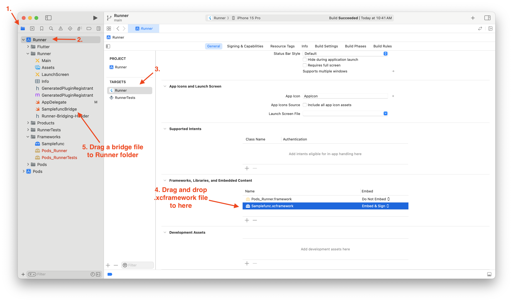

# Gomobile_Sample

This is a sample project to try out using the Golang library in Flutter via gomobile.

It builds and uses `samplefunc.go` (inside the `go_sample` folder) as a native library for mobile platforms.

## Step by Step for iOS

1. Prepare Go Project
	* In this sample project, it is `go_sample`
2. Build with gomobile, 
	 *	command will be `gomobile bind -target=ios`
3. Copy a generated .xcframework to ios folder in project.
	* In this sample project, it is `ios/Samplefunc.xcframework`
4. Write Swift bridge code. You need Swift code to call the native library. It seems to do the job of specifying the type for each function arguments. 
	* In this sample project, it is `ios/Runner/SamplefuncBridge.swift`.
5. Edit `ios/Runner/AppDelegate.swift`, i add a single line to register plugin for Golibrary
6. Write the code for your app in Flutter. To communicate with Swift in Dart, it uses a method called `MethodChannel`. Check out the comments in the `main.dart`
7. Open `ios/Runner.xcworkspace` with Xcode. You need to add the bridge swift code you wrote, and the xcframework to your project via Xcode. Check the picture below!
8. Once you have this setup in Xcode, you can later run the app by simply running `flutter run` in the terminal. However, if you modify and rebuild the Go library, it's probably safe to redo the Xcode configuration as well. 

## Step by Step for Android

## Reference
* [Go wiki: Mobile](https://go.dev/wiki/Mobile)
* [Flutter docs for MethodChannel](https://docs.flutter.dev/platform-integration/platform-channels)